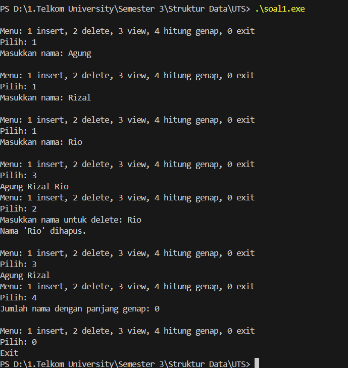

UJIAN TENGAH SEMESTER PRAKTIKUM STRUKTUR DATA CLO 3

Identitas Pengumpul
Nama: Alvin Aldino Rahmatullah
NIM: 103112430283
Kelas : IF-12-05
Soal : Ganjil (1)

1. Kode Program

Berikut adalah kode program untuk [jelaskan singkat tujuan kode, misal: "program C++ untuk mengecek bilangan ganjil/genap"].

(Silakan ganti bahasa dan kode di bawah ini sesuai tugas Anda)

```File: soal1.cpp
 * Author: [Alvin Aldino Rahmatullah]
 * NIM: [103112430283]
 * Deskripsi: User menginput tiga nama dengan dan mereka dapat memilih menu sehingga nantinya program dapat cek nama yang genap
 */

// Author: Alvin Aldino Rahmatullah
// NIM: 103112430283
// Kelas: IF-12-05

#include <iostream>
using namespace std;

struct Node {
    string nama; // data nama
    Node* next; // pointer ke node berikutnya
};

Node* head = NULL; // ke head linked list
    
// fungsi untuk menambahkan insert di akhir
void insertAkhir(string nama) { 
    Node* newNode = new Node(); // membuuat node baru
    newNode->nama = nama; // mengisi data
    newNode->next = NULL;   
    if (head == NULL) { // jika list kosong 
        head = newNode; // maka head menunjuk ke node baru
    } else { // jika list berisi
        Node* temp = head;
        while (temp->next != NULL) {
            temp = temp->next; // pindah ke node berikutnya
        }
        temp->next = newNode;  // penghubung node terakhir dengan yang baru
    }
}

// fungis untuk menghapus node berdasarkann string nama 
void deleteNama(string nama) {
    if (head == NULL) { // jika list kosong
            cout << "List kosong!\n";
            return;
        }
        Node* temp = head;
        while (temp->next != NULL && temp->next->nama != nama) { // mencari nama 
            temp = temp->next; // akan pindah ke node berikutnya
        }
        if (head->nama == nama) { // jika nama ada 
            Node* temp = head;
            head = head->next;
            cout << "Nama '" << temp->nama << "' dihapus.\n";
            delete temp; // maka hapus node
            return;
        } else { 
            Node* hapus = temp->next;
            temp->next = temp->next->next;
            cout << "Nama '" << hapus->nama << "' dihapus.\n";
            delete hapus;
        }     
}    

// fungsi untuk melihat isi lingked list
void viewList() {
    if (head == NULL) { // jika list kosong
        cout << "List kosong.\n"; // maka menampilkan pesan
        return;
    }
    Node* temp = head; 
    while (temp != NULL) { // melakukan perulangan selama temp tidak NULL
        cout << temp->nama << " "; // menampilkan data nama
        temp = temp->next;
    }
    
}

// fungsi untuk menghitung nama dengan panjang genap
void hitungGenap() {
    int count = 0; // inisialisasi count
    Node* temp = head; 
    while (temp != NULL) { // melakukan perulangan selama temp tidak NULL
        if (temp->nama.length() % 2 == 0) { // jika panjang nama genap 
            count++; // maka count bertambah 1
        }
        temp = temp->next;
    }
    cout << "Jumlah nama dengan huruf genap : " << count << "\n"; // output jumlah nama genap
}

// fungsi utama
int main() {
    int pilihan; // variabel untuk menyimpan pilihan menu
    string nama; // variabel untuk menyimpan nama
    
    do { // perulangan pada menu
        cout << "\nMenu: 1 insert, 2 delete, 3 view, 4 hitung genap, 0 exit\n"; // pilihan menu
        cout << "Menu ";
        cin >> pilihan; // input pilihan menu
        
        switch(pilihan) { // case berdasarkan pilihan menu
            case 1: 
                cout << "Masukkan nama: ";
                cin >> nama;
                insertAkhir(nama); // memanggil fungsi insert
                break;
            case 2:
                cout << "Masukkan nama untuk delete: ";
                cin >> nama;
                deleteNama(nama); // memanggil fungsi delete
                break;
            case 3:
                viewList(); // memanggil fungsi view
                break;
            case 4:
                hitungGenap(); // memanggil fungsi hitung genap
                break;
            case 0:
                cout << "Exit\n"; // keluar dari program
                break;
            default:
                cout << "Pilihan salah!\n"; // pilihan selain case 
        }
    } while(pilihan != 0); // selama pilihan bukan 0
    
    return 0;
}


```

2. Output Program



4. Penjelasan Lanjutan (Analisis Output)
Jadi program ini bikin sistem penyimpanan data nama mahasiswa pake linked list. Aku milih pakai linkedlist karena perintah soal:) (Bercanda), Soalnya linked list itu flexible, kita bisa nambah dan hapus data semau kita tanpa perlu khawatir soal kapasitas, beda kalo pake array yang size-nya  itu fix.
Cara kerjanya tuh kayak rangkaian kereta, setiap gerbong (node) itu nyimpen nama dan punya koneksi ke gerbong berikutnya. Head itu kayak lokomotifnya, yang nunjuk ke gerbong pertama. Yang keren dari linked list ini, waktu hapus data, kita tinggal putusin sambungannya trus sambung lagi ke node berikutnya. Efisien banget dan ga buang-buang memory

Fitur-fitur yang ada:
Insert akhir: Kita masukin nama baru di ujung paling belakang
Delete nama: Kita cari nama tertentu dan hapus dari rangkaian
View list: Lihat semua nama yang udah disimpen
Hitung genap: Hitung berapa nama yang jumlah hurufnya genap


5. Kesimpulan
Linked List itu Flexible Banget
Kita bisa nambah data sebanyak-banyaknya tanpa perlu khawatir kapasitas penuh
Penambahan dan penghapusan data lebih efisien dibanding array
Struktur Data yang Mirip Rantai
Setiap node saling terhubung seperti mata rantai
Head sebagai titik awal, tail sebagai akhir 

Operasi Dasar yang aku pakai
Insert: Tambah data di mana aja (di sini khusus di akhir)
Delete: Hapus data spesifik tanpa ganggu data lain
Traverse: Jelajahi semua data dengan mudah
Analisis data: Bisa hitung atau proses data sesuai kebutuhan
